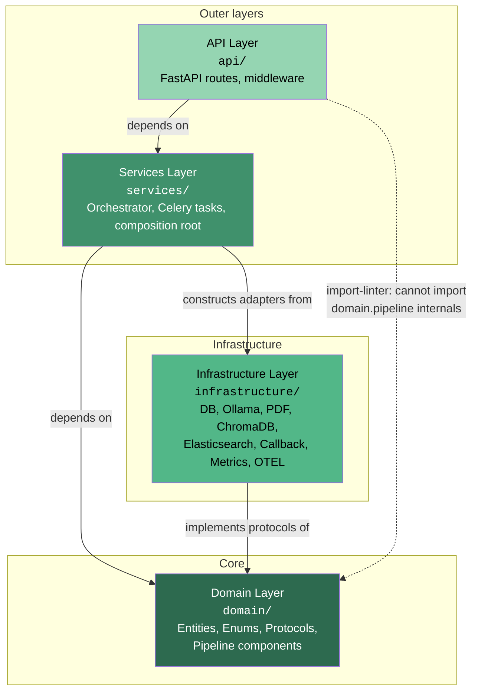
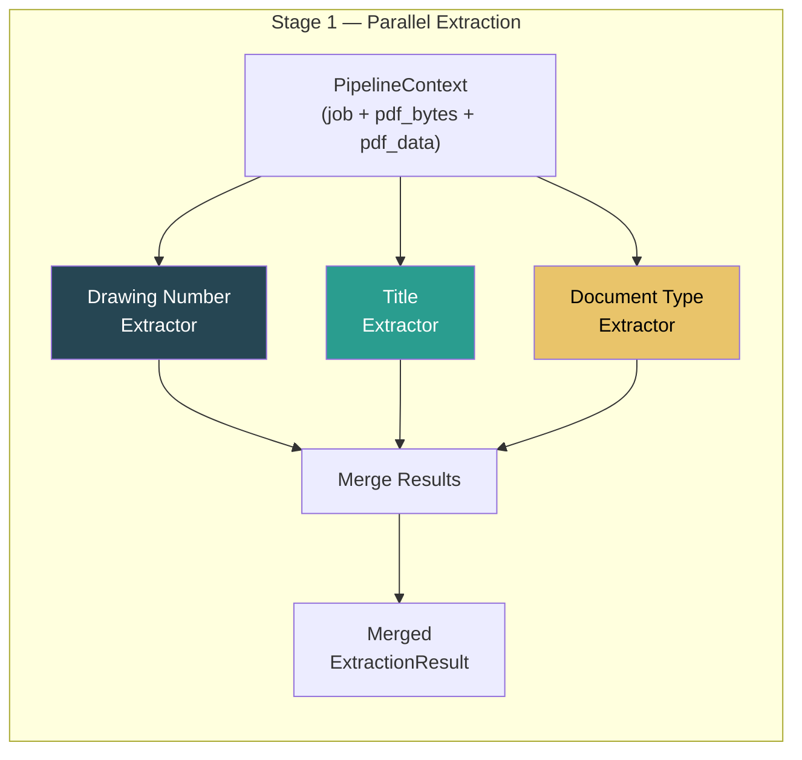
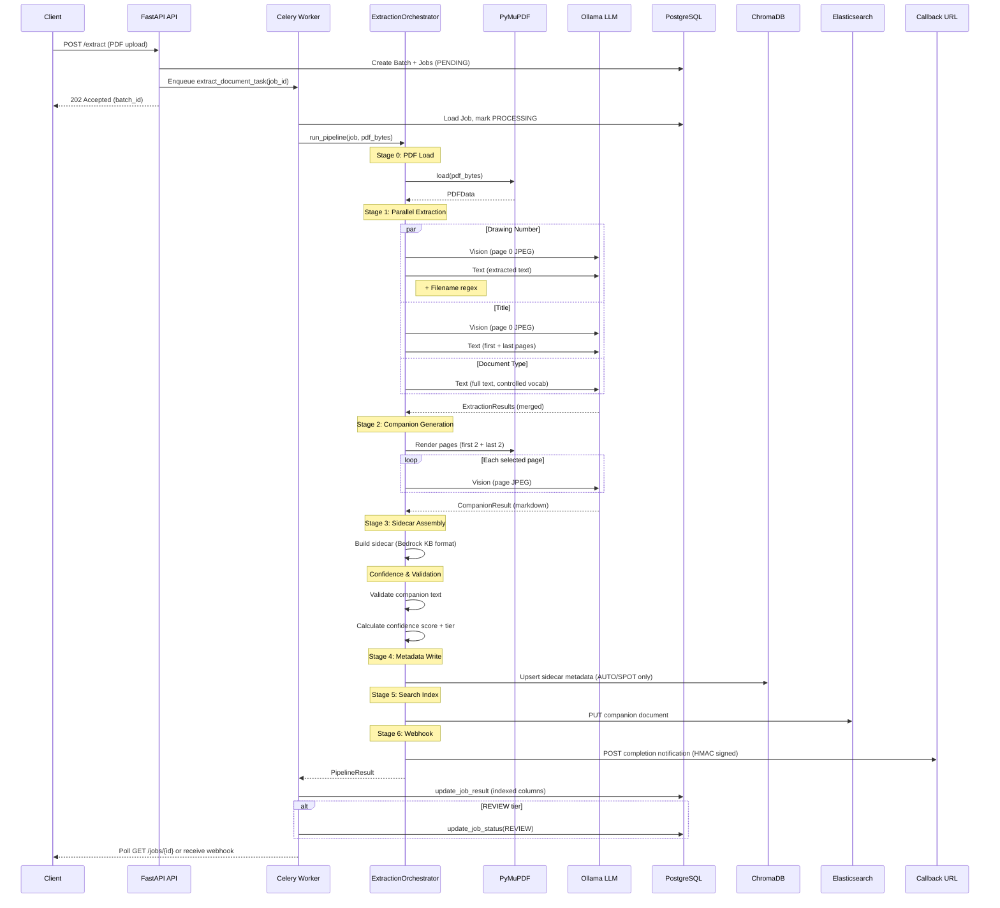

# Architecture

This document describes the high-level architecture of the **zubot_ingestion** service -- a FastAPI + Celery microservice that extracts structured metadata from construction PDFs using LLM-powered vision and text analysis.

**Audience:** Developers taking ownership of the codebase.

---

## Table of Contents

- [High-Level Architecture](#high-level-architecture)
- [Dependency Direction & Layer Rules](#dependency-direction--layer-rules)
- [Composition Root](#composition-root)
- [Extraction Pipeline (6 Stages)](#extraction-pipeline-6-stages)
  - [Stage 1: Metadata Extraction](#stage-1-metadata-extraction)
  - [Stage 2: Companion Document Generation](#stage-2-companion-document-generation)
  - [Stage 3: Sidecar Document Assembly](#stage-3-sidecar-document-assembly)
  - [Confidence & Validation](#confidence--validation)
  - [Stage 4: Metadata Persistence (ChromaDB)](#stage-4-metadata-persistence-chromadb)
  - [Stage 5: Search Indexing (Elasticsearch)](#stage-5-search-indexing-elasticsearch)
  - [Stage 6: Webhook Callback](#stage-6-webhook-callback)
- [Full Pipeline Sequence](#full-pipeline-sequence)
- [How to Add a New Extractor](#how-to-add-a-new-extractor)
- [Celery Task Architecture](#celery-task-architecture)

---

## High-Level Architecture

The service follows a **hexagonal (ports-and-adapters)** architecture organised into four layers:

| Layer | Directory | Responsibility |
|---|---|---|
| **API** | `api/` | FastAPI routes, middleware (auth, rate limiting, request logging), HTTP request/response handling |
| **Services** | `services/` | Application services, Celery task definitions, composition root (dependency injection) |
| **Domain** | `domain/` | Pure business logic, entities (dataclasses), enums, protocols (interfaces), pipeline components |
| **Infrastructure** | `infrastructure/` | External adapters: PostgreSQL/SQLAlchemy, Ollama HTTP client, PyMuPDF PDF processor, ChromaDB writer, Elasticsearch indexer, callback HTTP client, Prometheus metrics, structlog logging, OTEL instrumentation |

The **domain layer** is the innermost layer. It defines protocols (interfaces) that the infrastructure layer implements -- this is the **dependency inversion** principle. The domain never imports from any outer layer.



> **Key insight:** Infrastructure adapters implement domain protocols (e.g. `ChromaDBMetadataWriter` implements `IMetadataWriter`), but the domain layer never imports infrastructure. The services layer acts as the composition root, wiring concrete adapters to protocol-typed constructor parameters.

---

## Dependency Direction & Layer Rules

Layer boundaries are enforced at CI time by **import-linter** (config: `.importlinter` in repo root).

Three contracts are defined:

### 1. Layered Architecture

```
layers = api > services > infrastructure > domain
```

Higher layers may import lower layers. Domain is innermost -- nothing may import upward.

### 2. Domain Purity

```ini
[importlinter:contract:forbidden-domain]
name = Domain cannot import infrastructure or api or services
type = forbidden
source_modules = zubot_ingestion.domain
forbidden_modules =
    zubot_ingestion.infrastructure
    zubot_ingestion.api
    zubot_ingestion.services
```

The domain layer contains **only** pure business logic, entities, enums, and protocol definitions. It depends on stdlib and `zubot_ingestion.shared` only.

### 3. API Isolation

```ini
[importlinter:contract:forbidden-api-pipeline]
name = API cannot import domain.pipeline internals or infrastructure
type = forbidden
source_modules = zubot_ingestion.api
forbidden_modules =
    zubot_ingestion.domain.pipeline
    zubot_ingestion.infrastructure
```

The API layer cannot reach into pipeline internals directly. A small set of `ignore_imports` carve-outs exist for cross-cutting concerns (logging setup, OTEL instrumentation, Prometheus metrics endpoint, and specific route-level imports for database session/repository/PDF processor).

Run the check locally:

```bash
lint-imports
```

---

## Composition Root

The **single composition root** lives in `src/zubot_ingestion/services/__init__.py`. This is the **only module** that imports concrete infrastructure adapters -- every other module depends on abstract protocols from `domain/protocols.py`.

### Factory Functions

**`build_orchestrator() -> IOrchestrator`**

Constructs a fully-wired `ExtractionOrchestrator` with all dependencies injected. Called by the Celery worker at task-start time. Rebuilds per call to keep dependency lifetimes simple.

```python
def build_orchestrator() -> "IOrchestrator":
    settings = get_settings()

    pdf_processor = PyMuPDFProcessor()
    ollama_client = OllamaClient(base_url=settings.OLLAMA_HOST, settings=settings)
    response_parser = JsonResponseParser()
    filename_parser = FilenameParser()

    drawing_number_extractor = DrawingNumberExtractor(
        pdf_processor=pdf_processor,
        ollama_client=ollama_client,
        response_parser=response_parser,
        filename_parser=filename_parser,
        vision_model=settings.OLLAMA_VISION_MODEL,
        text_model=settings.OLLAMA_TEXT_MODEL,
    )
    # ... title_extractor, document_type_extractor similarly ...

    return ExtractionOrchestrator(
        drawing_number_extractor=drawing_number_extractor,
        title_extractor=title_extractor,
        document_type_extractor=document_type_extractor,
        sidecar_builder=SidecarBuilder(),
        confidence_calculator=ConfidenceCalculator(),
        pdf_processor=pdf_processor,
        companion_generator=CompanionGenerator(...),
        metadata_writer=ChromaDBMetadataWriter(host=..., port=...),
        companion_validator=build_companion_validator(),      # optional
        search_indexer=build_search_indexer(settings),         # optional
        callback_client=build_callback_client(settings),       # optional
        settings=settings,
    )
```

All infrastructure imports are **lazy** (inside the function body) so that `import zubot_ingestion.services` does not drag in every adapter at module-load time.

**`get_job_repository() -> AsyncIterator[JobRepository]`**

An `@asynccontextmanager` that yields a `JobRepository` bound to a fresh async database session:

```python
@asynccontextmanager
async def get_job_repository() -> AsyncIterator[JobRepository]:
    async with get_session() as session:
        yield JobRepository(session)
```

Callers use `async with`:

```python
async with get_job_repository() as repo:
    job = await repo.get_job(job_id)
```

### Cross-Cutting Adapters

The `ExtractionOrchestrator` constructor accepts several **optional keyword-only** adapters that degrade gracefully when `None`:

| Adapter | Factory | Behaviour when `None` |
|---|---|---|
| `companion_validator` | `build_companion_validator()` | Validation step skipped; no confidence penalty |
| `search_indexer` | `build_search_indexer(settings)` | Stage 5 skipped; `NoOpSearchIndexer` returned when `ELASTICSEARCH_URL` is unset |
| `callback_client` | `build_callback_client(settings)` | Stage 6 skipped; `NoOpCallbackClient` returned when `CALLBACK_ENABLED=False` |
| `metadata_writer` | `ChromaDBMetadataWriter(...)` | Required (positional); Stage 4 failures are tolerated via try/except |

---

## Extraction Pipeline (6 Stages)

The pipeline is implemented in `ExtractionOrchestrator.run_pipeline()` at `src/zubot_ingestion/services/orchestrator.py`. Every stage is wrapped in its own OTEL span and try/except block. Failures are captured into `pipeline_trace['errors']` without re-raising -- the orchestrator **always** returns a structurally valid `PipelineResult`.

### Stage 1: Metadata Extraction

Three extractors run **concurrently** via `asyncio.gather`:



#### Drawing Number Extractor

**File:** `src/zubot_ingestion/domain/pipeline/extractors/drawing_number.py`

Multi-source fusion using three parallel sources:

1. **Vision** -- Renders page 0 as JPEG, sends to the vision model (e.g. `qwen2.5vl:7b`) to read drawing numbers from title blocks.
2. **Text** -- Extracts PDF text content, sends to the text model (e.g. `qwen2.5:7b`) to identify drawing numbers.
3. **Filename** -- Regex pattern matching against the original filename. Three patterns in priority order:
   - `\d{6}-[A-Z]-\d{3,4}` (confidence 0.90)
   - `[A-Z]\d{2,3}-\d{2,4}` (confidence 0.75)
   - `DWG-\d+` (confidence 0.70)

**Confidence scoring (weighted voting):**

| Agreement | Confidence |
|---|---|
| All 3 sources agree | **0.95** |
| 2 of 3 agree | **0.75** |
| Single source only | **0.50** |
| All disagree | **0.30** |

**Priority on disagreement:** vision > text > filename.

#### Title Extractor

**File:** `src/zubot_ingestion/domain/pipeline/extractors/title.py`

Two-source fusion:

1. **Vision** -- Reads the title block from page 0 JPEG via the vision model.
2. **Text** -- Analyzes extracted text from the **first AND last** pages via the text model.

**Reconciliation rules:**

| Scenario | Result |
|---|---|
| Both agree | Boost confidence to at least **0.90** |
| Only one has a value | Use that value with its native confidence |
| Both disagree | Prefer vision, apply **0.70** penalty multiplier |

Multi-line titles are flattened to single lines with single spaces.

#### Document Type Extractor

**File:** `src/zubot_ingestion/domain/pipeline/extractors/document_type.py`

Text-only classification. Sends the full extracted PDF text to the text model with a controlled-vocabulary prompt built from the `DocumentType` enum (21 types). The model must respond with one of the legal enum values.

Out-of-vocabulary responses fall back to `DocumentType.DOCUMENT` with a reduced confidence of **0.30**.

#### Filename Parser

**File:** `src/zubot_ingestion/domain/pipeline/extractors/filename_parser.py`

A pure-Python, OS-agnostic helper (no I/O, no infrastructure dependencies) that extracts:

- **Drawing number** -- via regex patterns (see above)
- **Revision hints** -- e.g. "Rev P02"
- **Discipline** -- keyword matching against path segments and filename (e.g. `elec` -> `electrical`)

---

### Stage 2: Companion Document Generation

**File:** `src/zubot_ingestion/domain/pipeline/companion.py`

Produces a structured markdown **companion document** that describes the visual content of the PDF in human-readable form.

**Page selection:** First 2 + last 2 pages (deduplicated), up to `MAX_COMPANION_PAGES = 4`.

**Per-page skip heuristic:** When `COMPANION_SKIP_ENABLED=true` (default: `false`) and a page has more than `COMPANION_SKIP_MIN_WORDS` words of extractable text, the vision call for that page is skipped. The decision is made **per page**, not per document -- so a drawing set with a sparse title block and dense specification pages still renders the title block through the vision model.

**Process per page:**
1. Render page to JPEG via `IPDFProcessor`
2. Send JPEG to vision model with a descriptive prompt
3. Parse vision response

**Output:** Markdown document with three sections:
- `VISUAL DESCRIPTION` -- per-page descriptions
- `TECHNICAL DETAILS` -- extracted technical content
- `METADATA` -- extraction field values from Stage 1

Failures on individual pages are tolerated -- the page is dropped rather than failing the entire stage.

---

### Stage 3: Sidecar Document Assembly

**File:** `src/zubot_ingestion/domain/pipeline/sidecar.py`

Combines Stage 1 extraction results and Stage 2 companion output into an **AWS Bedrock Knowledge Base sidecar** format.

**Constraints:**
- Maximum **10** metadata attributes (AWS Bedrock KB limit)
- Output is JSON Schema validated

**Required attributes** (always present):

| Key | Source |
|---|---|
| `source_filename` | `job.filename` |
| `document_type` | Stage 1 extraction |
| `extraction_confidence` | Derived from per-field scores |

**Optional attributes** (included when available, subject to the 10-attribute budget):

| Key | Source |
|---|---|
| `drawing_number` | Stage 1 extraction |
| `title` | Stage 1 extraction |
| `discipline` | Stage 1 extraction |
| `revision` | Stage 1 extraction |
| `building_zone` | Stage 1 extraction |
| `project` | Stage 1 extraction |

The builder derives a local confidence score using the same weights as the confidence calculator:
- `drawing_number` (40%) + `title` (30%) + `document_type` (30%)

Returns a frozen `SidecarDocument` dataclass.

---

### Confidence & Validation

These steps run between Stage 3 and Stage 4.

#### Companion Validation

**File:** `src/zubot_ingestion/domain/pipeline/validation.py`

Rule-based validation of the Stage 2 companion text:

1. **`empty_companion`** -- companion text is empty or whitespace-only
2. **`companion_too_short`** -- length < 50 characters
3. **`field_not_referenced_{field}`** -- for each of `drawing_number`, `title`, `document_type`: if the extraction has confidence > 0 and a non-null value, it must appear in the companion text (case-insensitive)

**Quality score:** `fields_referenced / total_fields_with_confidence`, clamped to `[0.0, 1.0]`. Defaults to `1.0` when no fields have confidence > 0.

#### Confidence Calculation

**File:** `src/zubot_ingestion/domain/pipeline/confidence.py`

Collapses per-field confidence scores into an overall score and tier:

```python
weighted = (
    drawing_number_confidence * 0.40   # CONFIDENCE_WEIGHT_DRAWING_NUMBER
    + title_confidence        * 0.30   # CONFIDENCE_WEIGHT_TITLE
    + document_type_confidence * 0.30  # CONFIDENCE_WEIGHT_DOCUMENT_TYPE
)
if validation_result and not validation_result.passed:
    weighted += CONFIDENCE_VALIDATION_PENALTY   # negative value
weighted = clamp(weighted, 0.0, 1.0)
```

**Confidence tiers:**

| Tier | Threshold | Downstream Action |
|---|---|---|
| `AUTO` | `>= CONFIDENCE_TIER_AUTO_MIN` (0.8) | Auto-publish; written to ChromaDB |
| `SPOT` | `>= CONFIDENCE_TIER_SPOT_MIN` (0.5) | Publish, flagged for spot-check |
| `REVIEW` | `< 0.5` | Blocked on human reviewer |

---

### Stage 4: Metadata Persistence (ChromaDB)

**File:** `src/zubot_ingestion/infrastructure/chromadb/writer.py`

Writes the Stage 3 sidecar metadata to a **ChromaDB collection**.

- **Collection naming:** `zubot_metadata_{deployment_id}_{node_id}`
- **Provenance marker:** `ingestion_service: zubot-ingestion`
- **Execution:** `asyncio.to_thread` (ChromaDB client is synchronous)
- **Tier gating:** `AUTO` and `SPOT` results are written immediately. `REVIEW`-tier results are **not** written -- they go to the human review queue and are flushed to ChromaDB only after approval.
- **Failure handling:** Logs and records in `pipeline_trace`; never re-raises.

---

### Stage 5: Search Indexing (Elasticsearch)

**File:** `src/zubot_ingestion/infrastructure/elasticsearch/indexer.py`

Indexes the companion document to Elasticsearch for full-text search.

- **Adapter:** `ElasticsearchSearchIndexer` -- HTTP PUT via `httpx.AsyncClient`
- **NoOp fallback:** `NoOpSearchIndexer` is returned by `build_search_indexer()` when `ELASTICSEARCH_URL` is unset. Returns success without network I/O.
- **Health check:** `/_cluster/health` endpoint
- **Failure handling:** Logs warnings; never raises.

---

### Stage 6: Webhook Callback

**File:** `src/zubot_ingestion/infrastructure/callback/client.py`

POSTs a completion notification to `callback_url` (sourced from the `Batch` entity).

- **Signing:** Optional HMAC-SHA256 signature in `X-Zubot-Signature` header
- **Authentication:** Optional `X-API-Key` header using the single-tenant `ZUBOT_INGESTION_API_KEY`
- **Retry policy:** Bounded exponential backoff (max 3 retries). 5xx and network errors retry; 4xx are non-retryable.
- **Gating:** Skipped when `callback_url` is empty or no callback client is wired.
- **NoOp fallback:** `NoOpCallbackClient` when `CALLBACK_ENABLED=False`

---

## Full Pipeline Sequence



---

## How to Add a New Extractor

Follow these steps to add a new metadata field extractor (e.g. a "revision extractor"):

### Step 1: Create the Extractor

Create a new file at `src/zubot_ingestion/domain/pipeline/extractors/your_field.py`.

### Step 2: Implement the `IExtractor` Protocol

The protocol is defined in `src/zubot_ingestion/domain/protocols.py`:

```python
@runtime_checkable
class IExtractor(Protocol):
    """Stage 1: Multi-source metadata extraction."""

    async def extract(self, context: PipelineContext) -> ExtractionResult:
        """Extract metadata fields from the pipeline context.

        Args:
            context: Pipeline context with PDF data, rendered images, extracted text

        Returns:
            ExtractionResult with extracted fields and per-field confidence scores
        """
        ...
```

Your extractor receives a `PipelineContext` (containing the `Job`, raw `pdf_bytes`, and loaded `PDFData`) and returns an `ExtractionResult` populated for your specific field(s).

### Step 3: Register in the Orchestrator

Edit `src/zubot_ingestion/services/orchestrator.py`:

1. Add a new constructor parameter for your extractor.
2. Add a new `self._run_extractor(...)` call in Stage 1, alongside the existing three.
3. Include it in the `asyncio.gather(...)` call.
4. Update `_merge_extraction_results()` to incorporate your field.

### Step 4: Wire in the Composition Root

Edit `src/zubot_ingestion/services/__init__.py`:

```python
from zubot_ingestion.domain.pipeline.extractors.your_field import YourFieldExtractor

your_extractor = YourFieldExtractor(
    pdf_processor=pdf_processor,
    ollama_client=ollama_client,
    response_parser=response_parser,
    # ... any additional dependencies
)
```

Pass it to `ExtractionOrchestrator(your_field_extractor=your_extractor, ...)`.

### Step 5: Update Confidence Weights

Edit `src/zubot_ingestion/shared/constants.py` to add a weight for your field. The weights must sum to 1.0 (rebalance existing weights). Then update `src/zubot_ingestion/domain/pipeline/confidence.py` to include the new component in the weighted sum.

### Step 6: Add Tests

- **Unit tests** for the extractor itself (mock the Ollama client and PDF processor)
- **Integration test** verifying the extractor is wired into `build_orchestrator()` and invoked during `run_pipeline()`
- Update import-linter `ignore_imports` if your composition root import creates a new cross-layer reference

---

## Celery Task Architecture

**File:** `src/zubot_ingestion/services/celery_app.py`

### Configuration

| Setting | Value | Rationale |
|---|---|---|
| Broker | Redis DB 2 | Separate from cache (DB 0) and result backend |
| Result backend | Redis DB 3 | Separate from broker |
| Serialization | JSON (args + results) | Interop, debugging |
| `worker_prefetch_multiplier` | 1 | Long-running tasks; no prefetch |
| `task_acks_late` | True | Ack after success, not on receive |
| `task_reject_on_worker_lost` | True | Redeliver on worker crash |
| `task_default_retry_delay` | 2s | Base retry delay |
| `task_max_retries` | 3 | Cap retries |

### Task: `extract_document_task`

The main Celery task with `autoretry_for=(Exception,)` and bounded exponential backoff.

**Execution flow:**

1. Load the `Job` from the repository via `get_job_repository()`
2. Load the parent `Batch` to get `deployment_id`, `node_id`, and `callback_url`
3. Read PDF bytes from `/tmp/zubot-ingestion/{batch_id}/{job_id}.pdf`
4. Build the orchestrator via `build_orchestrator()`
5. Mark job as `PROCESSING`
6. Run `orchestrator.run_pipeline(job, pdf_bytes, ...)`
7. Persist results via `update_job_result()` (populates indexed columns: `confidence_score`, `confidence_tier`, `processing_time_ms`, `otel_trace_id`, `pipeline_trace`)
8. For `REVIEW`-tier jobs: two-phase persist -- `update_job_result()` sets `COMPLETED`, then `update_job_status(REVIEW)` overwrites the status without clobbering indexed data

**Retry/cleanup policy:**

- `autoretry_for=(Exception,)` handles retries automatically
- The manual `except` block gates `_mark_job_failed()` on `self.request.retries >= self.max_retries` -- FAILED is only written on the **terminal** retry, preventing FAILED<->PROCESSING oscillation

### OTEL Tracing

Every pipeline run is wrapped in OTEL spans:

```
OTEL_SPAN_BATCH (root)
  └── OTEL_SPAN_JOB (per-job)
        ├── OTEL_SPAN_STAGE1_DRAWING_NUMBER
        ├── OTEL_SPAN_STAGE1_TITLE
        ├── OTEL_SPAN_STAGE1_DOC_TYPE
        ├── OTEL_SPAN_STAGE2_COMPANION
        ├── OTEL_SPAN_STAGE3_SIDECAR
        └── OTEL_SPAN_CONFIDENCE
```

The job span's `trace_id` (32-char lowercase hex) is persisted to `job.otel_trace_id` via `update_job_result()` for cross-referencing in trace backends.

### Structured Logging (CAP-029)

Celery signal hooks configure structlog in worker processes:

- `worker_process_init` -- initialises structured logging per worker process
- `task_prerun` -- binds `job_id`, `batch_id`, `file_hash` to context vars
- `task_postrun` -- logs completion, clears context
- `task_failure` -- logs failure with error details and traceback

Every log line emitted during a task run inherits the bound job context automatically.
